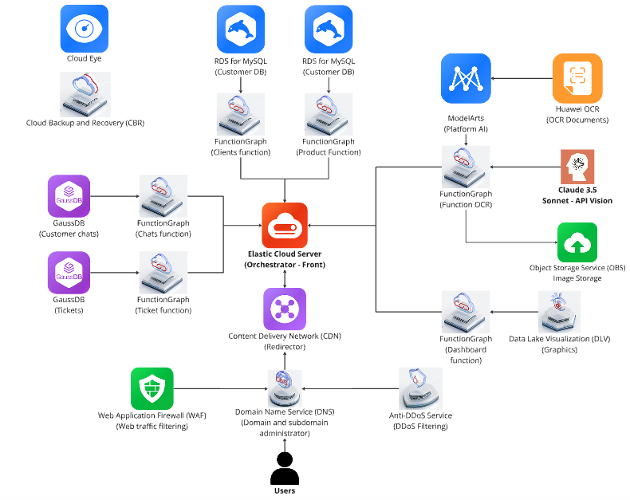
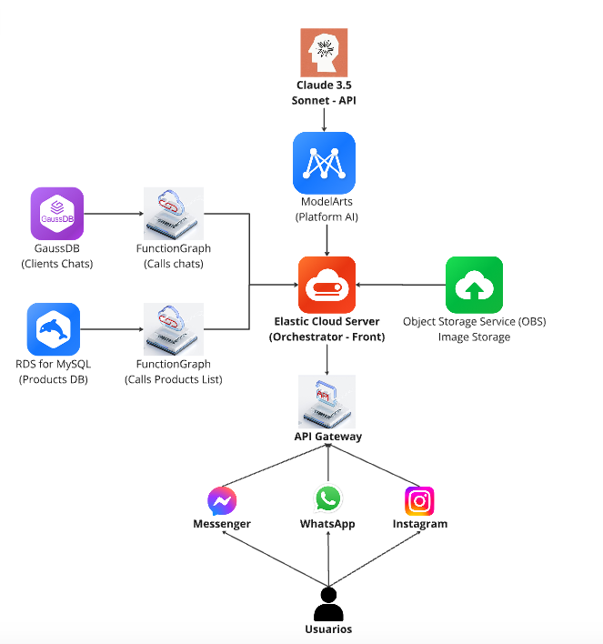

# AIVendo - Intelligent CRM Solution

## 📋 Project Overview

AIVendo is an AI-powered CRM platform designed to optimize sales and customer management for small and medium-sized businesses. Built on Huawei Cloud services, it provides advanced tools for document digitization, customer interaction, and business intelligence.

🔗 Quick Access Links

💻 CRM Dashboard
Access our complete AIVendo CRM Platform here: http://101.44.185.28:8000

💬 WhatsApp Bot
Chat with our AIVendo WhatsApp Assistant: https://wa.link/on5t0k

## 🎥 Demo CRM

<p align="center">
  
</p>

## 💡 Key Features

### 1. Intelligent OCR Module

- Automated document digitization
- Data virtualization
- Secure storage and handling

### 2. AI Sales Assistant (24/7)

- Personalized customer interactions
- Real-time social media management
- Sentiment analysis
- Multi-channel integration

### 3. Smart Ticket Management

- Automated ticket routing
- Priority-based handling
- Performance tracking
- Issue monitoring

### 4. Business Intelligence Dashboard

- Real-time metrics tracking
- Sales forecasting
- Predictive analytics
- Customer satisfaction monitoring

## 🏗️ Technical Architecture Huawei

<p align="center">
  
</p>

<p align="center">
  
</p>

### Core Infrastructure

- **Security Layer**

  - Secure DNS
  - Web Application Firewall (WAF)
  - Anti-DDoS protection
  - API Gateway for secure channel integration

- **Compute & Scaling**
  - Elastic Cloud Server (ECS) for request orchestration
  - FunctionGraph for serverless operations
  - Cloud Eye for resource monitoring

### Data Management

- **Storage Solutions**

  - RDS for MySQL: Product and customer data
  - GaussDB: Ticket management and chat history
  - Object Storage Service (OBS): Multimedia content

- **AI & Processing**
  - Huawei OCR: Document scanning and processing
  - ModelArts: AI model deployment
  - Claude 3.5 Sonnet: Natural language processing
  - Cloud Backup: Automated data protection

## 💼 Business Model

- **Subscription Tiers**
  - Starter ($300/month)
  - Gold ($600/month)
  - Premium ($900+/month)

## 📊 Scaling & Future Plans

1. **Initial Deployment** (Months 1-3)

   - Core feature launch
   - 5 pilot clients

2. **Market Penetration** (Months 4-12)

   - 100 client target
   - 10% market share goal

3. **Feature Expansion** (Months 13-18)

   - Advanced analytics
   - Customizable modules

4. **Regional Expansion** (Months 19-24)
   - Colombia
   - Chile
   - U.S. Hispanic market

# TechPro Store WhatsApp Bot

Bot de WhatsApp integrado con OpenAI y Twilio diseñado para TechPro Store. Gestiona automáticamente las consultas de productos, pedidos y atención al cliente. El bot maneja el catálogo de productos, sistema de envíos basado en ubicación, procesos de pago y almacena el historial de conversaciones en PostgreSQL para una experiencia personalizada.

## Estructura del Proyecto

- main.py: Servidor FastAPI y punto de entrada
- llm.py: Integración con OpenAI
- twilio_chat.py: Manejo de mensajes de WhatsApp
- database.py: Operaciones con la base de datos
- config.py: Configuración del sistema y prompt del bot
- Dockerfile: Configuración para Docker
- .env.example: Ejemplo de variables de entorno necesarias

## Ejecución Local

1. Instalar dependencias:
   pip install -r requirements.txt

2. Copiar .env.example a .env y configurar las variables

3. Ejecutar el servidor:
   python main.py

## Ejecución con Docker

1. Construir la imagen de Docker:

```bash
docker build -t tipakay .
```

2. Ejecutar el contenedor en segundo plano:

```bash
docker run -d --name docker_tipakay -p 5000:5000 --restart always tipakay
```

Comandos útiles de Docker:

```bash
# Ver logs del contenedor
docker logs docker_tipakay

# Detener el contenedor
docker stop docker_tipakay

# Reiniciar el contenedor
docker restart docker_tipakay

# Eliminar el contenedor
docker rm docker_tipakay
```

## Funcionalidades del Bot

- Saludo inicial automático
- Catálogo de productos con precios
- Gestión de pedidos
- Sistema de envíos para diferentes ciudades
- Manejo de pagos (contra entrega o adelanto según ubicación)
- Respuestas a preguntas frecuentes
- Historial de conversaciones

## 👥 Team TIPAKAY

- Sarai Alejandro Casas - Team Leader
- Melissa Vargas Lavado - UX/UI Designer
- Diego Rojas Vera - Software Developer
- Sebastián Lizárraga Calderón - AI Engineer
- Fransua León Sánchez - Cloud Architect
